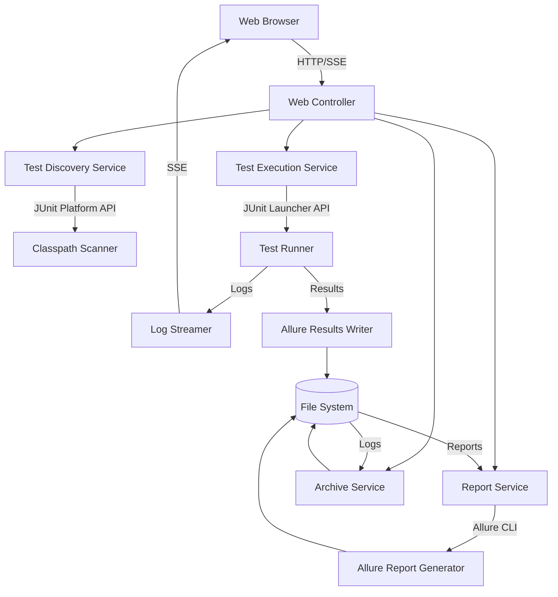

# Design Document: JUnit Web Launcher

## Overview

The JUnit Web Launcher is a Spring Boot web application that provides a browser-based interface for discovering, selecting, and executing JUnit test cases. The system uses the JUnit Platform Launcher API for test discovery and execution, Server-Sent Events (SSE) for real-time log streaming, and the Allure framework for comprehensive test reporting.

The architecture follows a layered approach with clear separation between test discovery, execution, reporting, and web presentation concerns. The system maintains a persistent archive of test results, logs, and reports to support historical analysis and trend tracking.

## Architecture

### High-Level Architecture



### Technology Stack

- **Backend Framework**: Spring Boot 3.x
- **Test Framework**: JUnit 5 (Jupiter) with Platform Launcher API
- **Reporting**: Allure Framework 2.x
- **Real-time Communication**: Server-Sent Events (SSE)
- **Frontend**: HTML5, JavaScript, CSS (use simple js lib e.g. alpine js, don't use React / Vue)
- **Build Tool**: Maven
- **Storage**: File system for reports and logs
- **Architecture**: Hexgonal Architecture, create modulized components

## Components and Interfaces

### 1. Test Discovery Service

**Responsibility**: Scan the classpath to identify JUnit test cases with optional package filtering.

**Key Methods**:
```java
public interface TestDiscoveryService {
    /**
     * Discovers all JUnit test cases in the classpath
     * @param packageFilter Optional package name to restrict scanning
     * @return Hierarchical structure of test classes and methods
     */
    TestTree discoverTests(String packageFilter);
}
```

**Implementation Details**:
- Uses `LauncherFactory.create()` to obtain a JUnit Launcher instance
- Builds `LauncherDiscoveryRequest` using `DiscoverySelectors.selectPackage()` or `selectClasspathRoots()`
- Applies `ClassNameFilter` when package filtering is specified
- Uses `Launcher.discover()` to obtain a `TestPlan`
- Traverses the `TestPlan` to build a hierarchical tree structure
- Filters out container nodes (test classes) vs. test nodes (test methods)

**Data Structure**:
```java
public class TestTree {
    private List<TestClass> testClasses;
}

public class TestClass {
    private String fullyQualifiedName;
    private String displayName;
    private List<TestMethod> testMethods;
}

public class TestMethod {
    private String uniqueId;
    private String methodName;
    private String displayName;
}
```

### 2. Test Execution Service

**Responsibility**: Execute selected test cases and stream execution logs in real-time.

**Key Methods**:
```java
public interface TestExecutionService {
    /**
     * Executes selected tests and returns execution ID
     * @param selectedTests List of test unique IDs to execute
     * @return Execution ID for tracking
     */
    String executeTests(List<String> selectedTests);
    
    /**
     * Cancels a running test execution
     * @param executionId The execution to cancel
     */
    void cancelExecution(String executionId);
    
    /**
     * Gets the current status of an execution
     * @param executionId The execution to check
     * @return Current execution status
     */
    ExecutionStatus getExecutionStatus(String executionId);
}
```

**Implementation Details**:
- Maintains a map of active executions with their Thread references
- Uses `LauncherDiscoveryRequest` with `DiscoverySelectors.selectUniqueId()` for each selected test
- Executes tests in a separate thread to avoid blocking the web request
- Implements custom `TestExecutionListener` to capture test events
- Captures stdout/stderr using custom `PrintStream` wrappers
- Writes Allure results using `@Allure` annotations or programmatic API
- Supports cancellation via `Thread.interrupt()` and cleanup

**Execution Flow**:
1. Create execution ID (timestamp-based UUID)
2. Build discovery request from selected test IDs
3. Create Allure results directory for this execution
4. Configure Allure lifecycle with results directory
5. Start execution in background thread
6. Register execution listener for status updates
7. Stream logs via SSE as tests execute
8. On completion or cancellation, finalize Allure results

### 3. Log Streaming Service

**Responsibility**: Capture test execution logs and stream them to the browser in real-time.

**Key Methods**:
```java
public interface LogStreamingService {
    /**
     * Registers a client for log streaming
     * @param executionId The execution to stream logs for
     * @return SseEmitter for streaming
     */
    SseEmitter streamLogs(String executionId);
    
    /**
     * Publishes a log message to all registered clients
     * @param executionId The execution this log belongs to
     * @param message The log message
     */
    void publishLog(String executionId, String message);
}
```

**Implementation Details**:
- Uses Spring's `SseEmitter` for Server-Sent Events
- Maintains a map of execution IDs to list of `SseEmitter` instances
- Captures System.out and System.err using custom `PrintStream` implementations
- Forwards captured output to all registered emitters for that execution
- Handles emitter completion and timeout events
- Cleans up emitters when execution completes or is cancelled

### 4. Report Service

**Responsibility**: Generate Allure reports from test results and provide access to reports.

**Key Methods**:
```java
public interface ReportService {
    /**
     * Generates an Allure report from execution results
     * @param executionId The execution to generate report for
     * @return Report metadata including path and timestamp
     */
    ReportMetadata generateReport(String executionId);
    
    /**
     * Lists all available reports
     * @return List of report metadata sorted by timestamp
     */
    List<ReportMetadata> listReports();
    
    /**
     * Combines multiple reports into one
     * @param reportIds List of report IDs to combine
     * @return Combined report metadata
     */
    ReportMetadata combineReports(List<String> reportIds);
}
```

**Implementation Details**:
- Executes Allure CLI command: `allure generate <results-dir> -o <report-dir> --clean`
- Uses `ProcessBuilder` to invoke Allure commandline tool
- Report directory naming: `allure-report-YYYY-MM-DD_HH-MM-SS`
- For report combination: copies all allure-results files into a single directory, then generates
- Stores report metadata (timestamp, execution ID, test counts) in JSON file alongside report
- Provides methods to serve report HTML files via Spring static resource handling

**Report Combination Strategy**:
Based on research, Allure supports combining reports by:
1. Copying all `allure-results` directories into a single directory
2. Running `allure generate` on the combined results directory
3. The generated report will show all tests from all runs

**History Tracking**:
- Before generating a new report, copy the `history` folder from the previous report into the current `allure-results` directory
- This enables Allure's trend charts and historical comparison features

### 5. Archive Service

**Responsibility**: Manage storage and retrieval of historical logs and reports.

**Key Methods**:
```java
public interface ArchiveService {
    /**
     * Saves execution logs to archive
     * @param executionId The execution ID
     * @param logs The log content
     */
    void archiveLogs(String executionId, String logs);
    
    /**
     * Lists all archived log files
     * @return List of log file metadata
     */
    List<LogFileMetadata> listLogFiles();
    
    /**
     * Retrieves log file content
     * @param logFileId The log file to retrieve
     * @return Log file content
     */
    String getLogFile(String logFileId);
    
    /**
     * Creates a downloadable archive of a report
     * @param reportId The report to archive
     * @return Path to ZIP file
     */
    Path createReportArchive(String reportId);
}
```

**Implementation Details**:
- Log files stored as: `logs/execution-YYYY-MM-DD_HH-MM-SS.log`
- Report archives created as ZIP files containing the entire report directory
- Maintains index files (JSON) for quick metadata retrieval
- Implements cleanup policies (optional: retain last N reports/logs)

### 6. Web Controller

**Responsibility**: Handle HTTP requests and coordinate between services.

**Key Endpoints**:
```java
@RestController
@RequestMapping("/api")
public class TestController {
    
    @GetMapping("/discover")
    public TestTree discoverTests(@RequestParam(required = false) String packageFilter);
    
    @PostMapping("/execute")
    public ExecutionResponse executeTests(@RequestBody ExecutionRequest request);
    
    @GetMapping("/stream/{executionId}")
    public SseEmitter streamLogs(@PathVariable String executionId);
    
    @PostMapping("/cancel/{executionId}")
    public void cancelExecution(@PathVariable String executionId);
    
    @GetMapping("/reports")
    public List<ReportMetadata> listReports();
    
    @GetMapping("/reports/{reportId}")
    public ResponseEntity<Resource> getReport(@PathVariable String reportId);
    
    @PostMapping("/reports/combine")
    public ReportMetadata combineReports(@RequestBody List<String> reportIds);
    
    @GetMapping("/logs")
    public List<LogFileMetadata> listLogs();
    
    @GetMapping("/logs/{logId}")
    public ResponseEntity<String> getLog(@PathVariable String logId);
}
```

## Data Models

### TestTree
Represents the hierarchical structure of discovered tests.

```java
public class TestTree {
    private List<TestClass> testClasses;
    private int totalTests;
    private String discoveryTimestamp;
}
```

### TestClass
Represents a test class containing test methods.

```java
public class TestClass {
    private String uniqueId;
    private String fullyQualifiedName;
    private String simpleName;
    private String displayName;
    private List<TestMethod> testMethods;
}
```

### TestMethod
Represents an individual test method.

```java
public class TestMethod {
    private String uniqueId;
    private String methodName;
    private String displayName;
    private List<String> tags;
}
```

### ExecutionRequest
Request payload for test execution.

```java
public class ExecutionRequest {
    private List<String> selectedTestIds;
    private String packageFilter;
}
```

### ExecutionResponse
Response containing execution tracking information.

```java
public class ExecutionResponse {
    private String executionId;
    private String status;
    private String timestamp;
}
```

### ExecutionStatus
Current status of a test execution.

```java
public enum ExecutionStatus {
    RUNNING,
    COMPLETED,
    CANCELLED,
    FAILED
}
```

### ReportMetadata
Metadata about a generated report.

```java
public class ReportMetadata {
    private String reportId;
    private String executionId;
    private String timestamp;
    private int totalTests;
    private int passedTests;
    private int failedTests;
    private int skippedTests;
    private String reportPath;
    private boolean isCombined;
    private List<String> combinedReportIds;
}
```

### LogFileMetadata
Metadata about an archived log file.

```java
public class LogFileMetadata {
    private String logId;
    private String executionId;
    private String timestamp;
    private long fileSizeBytes;
    private String filePath;
}
```


## Correctness Properties

A property is a characteristic or behavior that should hold true across all valid executions of a system—essentially, a formal statement about what the system should do. Properties serve as the bridge between human-readable specifications and machine-verifiable correctness guarantees.

### Property 1: Package Filter Restricts Discovery

*For any* package name filter and classpath containing test classes, when discovery is performed with that filter, all returned test cases should belong to classes within that package or its sub-packages.

**Validates: Requirements 1.2**

### Property 2: Discovery Organizes Tests by Class

*For any* discovered test tree, all test methods should be grouped under their containing test class, with no orphaned test methods.

**Validates: Requirements 1.3**

### Property 3: Test Class Data Completeness

*For any* test class in the discovery results, the data should include both the fully qualified class name and an accurate count of test methods that equals the actual number of test methods in that class.

**Validates: Requirements 1.4, 1.5**

### Property 4: Class Selection Synchronization

*For any* test class, when its selection state changes (selected or deselected), all test methods within that class should automatically have their selection state updated to match the class selection state.

**Validates: Requirements 2.4, 2.5**

### Property 5: Run Button Enablement

*For any* selection state, the Run button should be enabled if and only if at least one test case is selected.

**Validates: Requirements 2.6**

### Property 6: Executor Runs Selected Tests

*For any* set of selected test IDs, when execution is triggered, the test executor should run exactly those tests and no others.

**Validates: Requirements 3.1**

### Property 7: Log Streaming During Execution

*For any* test execution that generates log output, those log messages should appear in the SSE stream to connected clients.

**Validates: Requirements 3.2**

### Property 8: Test Result Status Validity

*For any* completed test case, its result status should be one of the valid values: passed, failed, or skipped.

**Validates: Requirements 3.4**

### Property 9: Log Message Chronological Order

*For any* sequence of log messages generated during execution, they should appear in the stream in the same chronological order they were generated, preserving causality.

**Validates: Requirements 3.5**

### Property 10: Cancellation Terminates Execution

*For any* running test execution, when cancellation is requested, the execution should transition to CANCELLED status and no further tests should execute.

**Validates: Requirements 4.2**

### Property 11: Cancellation Preserves Logs

*For any* cancelled execution, all log messages generated before the cancellation point should be preserved and accessible in the archived log file.

**Validates: Requirements 4.4**

### Property 12: Report Generation After Completion

*For any* completed test execution, an Allure report should be generated and stored in the report archive.

**Validates: Requirements 5.1**

### Property 13: Report Timestamp Naming

*For any* generated report, its identifier should include a timestamp in the format YYYY-MM-DD_HH-MM-SS that corresponds to the report generation time.

**Validates: Requirements 5.2**

### Property 14: Report Accessibility After Generation

*For any* generated report, the response should include a valid path or URL that allows viewing the report.

**Validates: Requirements 5.3**

### Property 15: Report Persistence

*For any* generated Allure report, it should be stored in the archive and retrievable through the list reports endpoint.

**Validates: Requirements 5.5**

### Property 16: Historical Reports List Completeness

*For any* set of stored reports in the archive, the list reports endpoint should return all of them without omission.

**Validates: Requirements 6.1**

### Property 17: Report Metadata Completeness

*For any* report in the historical list, its metadata should include both the timestamp and execution summary (test counts).

**Validates: Requirements 6.2**

### Property 18: Historical Report Retrieval

*For any* report ID in the historical list, there should be a valid endpoint that returns the report content for viewing.

**Validates: Requirements 6.3**

### Property 19: Historical Report Download

*For any* report ID in the historical list, there should be a valid endpoint that returns the report as a downloadable archive.

**Validates: Requirements 6.4**

### Property 20: Reports Sorted by Timestamp Descending

*For any* list of historical reports returned by the API, they should be sorted by timestamp in descending order (newest first).

**Validates: Requirements 6.5**

### Property 21: Log File Timestamp Naming

*For any* test execution, its log file should be stored with a timestamp-based name that corresponds to the execution time.

**Validates: Requirements 7.1**

### Property 22: Historical Logs List Completeness

*For any* set of stored log files in the archive, the list logs endpoint should return all of them without omission.

**Validates: Requirements 7.2**

### Property 23: Historical Log Retrieval

*For any* log file ID in the historical list, there should be a valid endpoint that returns the log content for viewing.

**Validates: Requirements 7.3**

### Property 24: Historical Log Download

*For any* log file ID in the historical list, there should be a valid endpoint that returns the log file as downloadable content.

**Validates: Requirements 7.4**

### Property 25: Logs Sorted by Timestamp Descending

*For any* list of historical log files returned by the API, they should be sorted by timestamp in descending order (newest first).

**Validates: Requirements 7.5**

### Property 26: Report Combination Merges All Tests

*For any* set of multiple report IDs selected for combination, the resulting combined report should contain all test cases from all selected reports.

**Validates: Requirements 8.3**

### Property 27: Combined Report Accessibility

*For any* successfully combined report, it should be accessible through both view and download endpoints.

**Validates: Requirements 8.4**

### Property 28: Combined Report Naming Convention

*For any* combined report, its name or metadata should clearly indicate that it is a merged report (e.g., containing "combined" or "merged" in the identifier).

**Validates: Requirements 8.5**

### Property 29: Re-run Executes Only Failed Tests

*For any* re-run request based on a previous execution, only the test cases that failed in that execution should be executed, excluding passed and skipped tests.

**Validates: Requirements 9.2**

### Property 30: Re-run Generates New Report

*For any* completed re-run execution, a new Allure report should be generated and stored in the archive.

**Validates: Requirements 9.3**

### Property 31: Combined Re-run Shows Updated Status

*For any* combination of an original report and its re-run report, the combined report should display the most recent status for each test case (showing the re-run result for tests that were re-executed).

**Validates: Requirements 9.5**

## Error Handling

### Test Discovery Errors
- **Empty Classpath**: If no tests are found, return an empty test tree with appropriate message
- **Invalid Package Filter**: If package doesn't exist, return empty results (not an error)
- **Classpath Scanning Failure**: Log error and return partial results if possible

### Test Execution Errors
- **Invalid Test ID**: Return 400 Bad Request with descriptive error message
- **Execution Already Running**: Return 409 Conflict if trying to start execution while one is running
- **Test Execution Failure**: Individual test failures are captured in results, not system errors
- **Thread Interruption**: Handle gracefully during cancellation, ensure cleanup

### Report Generation Errors
- **Allure CLI Not Found**: Return 500 with clear message about missing Allure installation
- **Report Generation Failure**: Log error, preserve results directory for debugging
- **Insufficient Disk Space**: Return 507 Insufficient Storage with appropriate message

### Archive Access Errors
- **Report Not Found**: Return 404 Not Found for invalid report IDs
- **Log File Not Found**: Return 404 Not Found for invalid log file IDs
- **File Read Errors**: Return 500 with error details, log for investigation

### SSE Connection Errors
- **Client Disconnect**: Clean up emitter, remove from active connections
- **Timeout**: Close emitter after configured timeout (e.g., 30 minutes)
- **Send Failure**: Log error, attempt to close emitter gracefully

## Testing Strategy

### Unit Testing Approach

Unit tests will verify specific examples, edge cases, and error conditions for individual components:

- **Test Discovery Service**: Test with known test classes, empty classpath, various package filters
- **Test Execution Service**: Test with single test, multiple tests, cancellation scenarios
- **Log Streaming Service**: Test emitter lifecycle, multiple clients, disconnection handling
- **Report Service**: Test report generation, listing, combination with mock file system
- **Archive Service**: Test file storage, retrieval, sorting with temporary directories

Unit tests should focus on:
- Specific examples that demonstrate correct behavior (e.g., discovering a known test class)
- Edge cases (empty inputs, single items, large datasets)
- Error conditions (missing files, invalid IDs, concurrent access)
- Integration points between components

### Property-Based Testing Approach

Property-based tests will verify universal properties across all inputs using a PBT library (e.g., jqwik for Java):

- **Minimum 100 iterations per property test** to ensure comprehensive input coverage
- Each property test must reference its design document property using the tag format:
  - **Feature: junit-web-launcher, Property {number}: {property_text}**

Property tests should focus on:
- **Invariants**: Properties that hold regardless of input (e.g., log order preservation)
- **Filtering correctness**: Package filters always restrict results appropriately
- **Data completeness**: All required fields present in responses
- **Ordering guarantees**: Lists sorted correctly regardless of input order
- **State synchronization**: Selection states remain consistent
- **Idempotency**: Operations that should produce same result when repeated

### Testing Framework

- **Unit Testing**: JUnit 5 with Mockito for mocking
- **Property-Based Testing**: jqwik (https://jqwik.net/) for Java property-based testing
- **Integration Testing**: Spring Boot Test with TestRestTemplate
- **Frontend Testing**: Jest or similar for JavaScript property tests

### Test Data Generation

For property-based tests, generators should:
- Generate realistic test class structures (valid Java identifiers, reasonable method counts)
- Generate valid package names following Java naming conventions
- Generate realistic execution scenarios (various test counts, pass/fail ratios)
- Generate edge cases (empty lists, single items, maximum sizes)

### Continuous Integration

- Run all unit tests on every commit
- Run property-based tests with reduced iterations (e.g., 20) in CI for speed
- Run full property-based tests (100+ iterations) nightly or before releases
- Fail build on any test failure
- Generate and archive test reports for analysis
